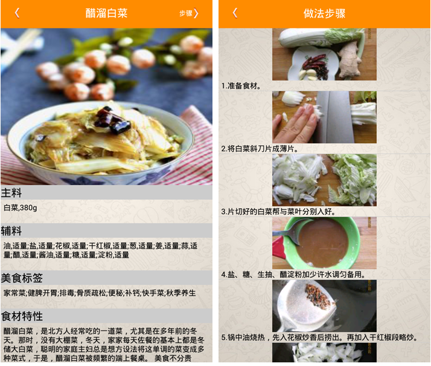

# TSOF
该项目是一个基于安卓的美食查询application，它能够为用户推荐美食，同时提供食物的具体做法。其中本体的含义在于该应用会根据用户点击内容分析用户喜好，从而进行针对性的推荐。

#### 文件结构

**tsof**：该项目源码；

**Food_Recommend.apk**：该app所对应的apk文件，可以直接下载到安卓手机上安装运行；

**软件说明书.pdf**：该项目所对应的软件说明书，详情请参见[这里](https://nbviewer.jupyter.org/github/JiaShengLiu111/TSOF/blob/master/%E8%BD%AF%E4%BB%B6%E8%AF%B4%E6%98%8E%E4%B9%A6.pdf)；

#### 应用界面

**首页**：

**菜单**：

**菜式做法详情**：

**搜索页面**：

**搜索结果**：

**收藏页面**：

